# Experiment analysis

Complete this file after running `run_experiments.py`.

1. Which configuration achieved the highest validation accuracy?
2. How did learning rate affect convergence?
3. How did batch size affect accuracy and training time?
4. How did SGD and Adam differ?
5. Compare all four classifiers. Which would you select and why?

6. For CNN and ViT, how did increasing the number of layers from 2 to 5 affect
accuracy, convergence, and training time?

7. For CNN and ViT, compare plain SGD, SGD with momentum, Adam, and AdamW.
What differences did you observe, and which optimizer would you select?

## Answers

### Question 1: Which configuration achieved the highest validation accuracy?
The configuration with the highest validation accuracy was the "conv_layers_5" (a 5-layer Convolutional Neural Network) with a batch size of 128, a learning rate of 0.001, and the Adam optimizer, achieving a validation accuracy of approximately 77.7%.

<!-- 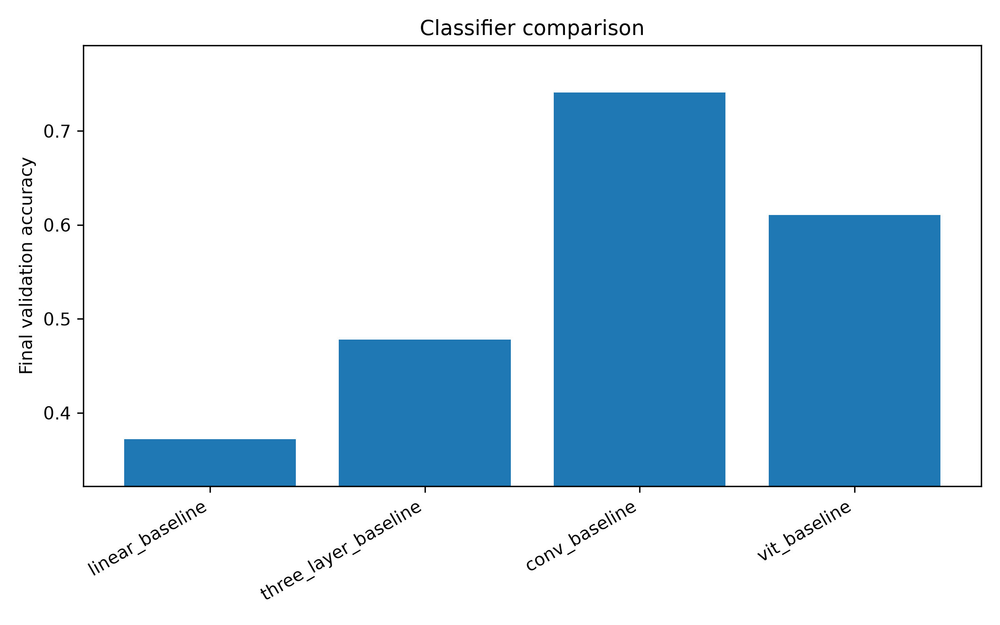 -->

### Question 2:  How did learning rate affect convergence?
Reducing the learning rate (LR) from 0.001 to 0.0001 resulted in slower convergence and lower validation accuracy, further exacerbated by the few epochs (10) used for training. Using the "conv_baseline" with LR 0.001 and "conv_lr_0001" with LR 0.0001, we see a decrease in validation accuracy from 73.4% to 58.5%. Likewise, for the ViT "vit_baseline" and "vit_lr_0001", the performance drops from 61.04% to 55.4%. From the first step for the CNN, we see a significant difference in convergence rate, achieving 53.92% vs 40.27%; we see a similar convergence rate with the ViT.
<!-- 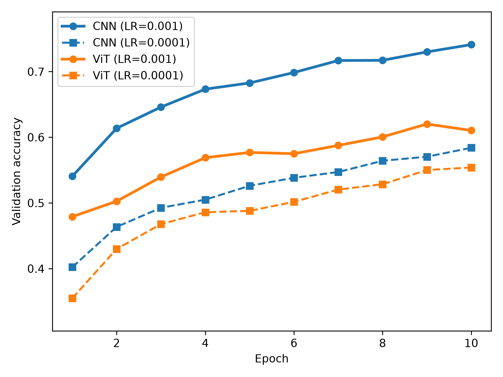 -->

<!-- 
conv_baseline,conv,adam,10,10,128,0.001,,2,598,0.82664020,0.73470000,3.0096

conv_lr_0001,conv,adam,10,10,128,0.0001,,2,598,1.30416761,0.58520000,2.9735

vit_baseline,vit,adam,10,10,128,0.001,,2,598,1.08878851,0.61040000,3.7338

vit_lr_0001,vit,adam,10,10,128,0.0001,,2,598,1.30626318,0.55400000,3.7448 -->

### Question 3 : How did batch size affect accuracy and training time?
Comparing the CNN "conv_baseline" and "conv_batch_64", reducing the batch size from 128 to 64 produced slightly better performance from 73.47% to 74.5%, however, it increased the total training time from 30.09s to 34.63s and increased average epoch time from 3.01s/epoch to 3.46s/epoch because with a smaller batch size, we need to take more steps to complete one epoch. Likewise, for the ViT, accuracy increased from 61.04% to 62.72% with epoch time increasing from 3.7338s to 4.7197s.

Reducing the batch size from 128 to 64 results in slightly better performance; however, it increases training time as we perform twice as many update steps per epoch.

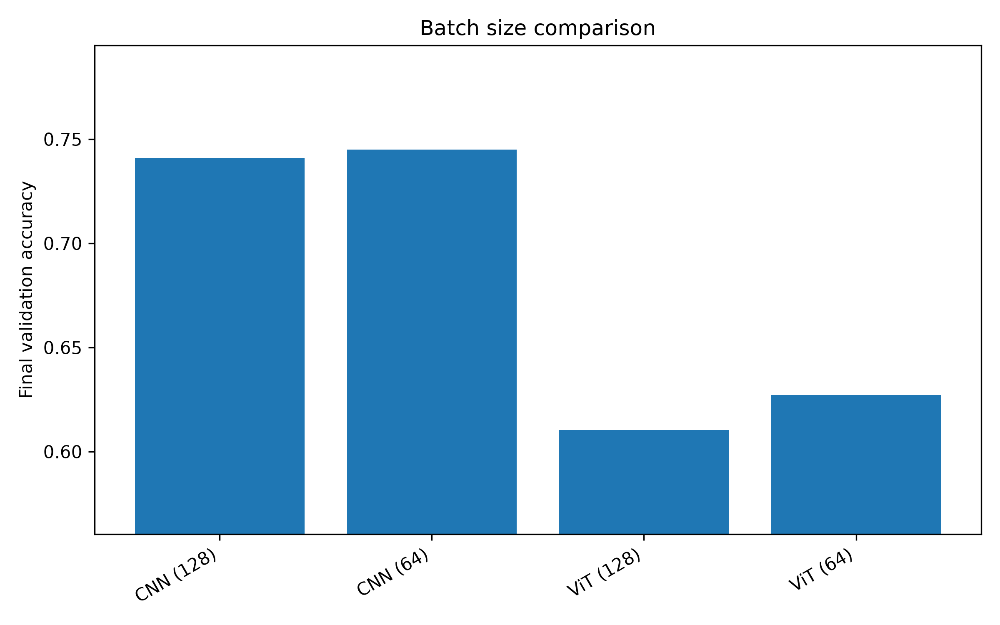
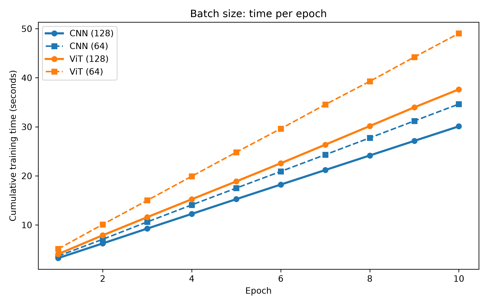

<!-- conv_batch_64,conv,adam,10,10,64,0.001,,2,598,0.78470816,0.74500000,3.5294
conv_baseline,conv,adam,10,10,128,0.001,,2,598,0.82664020,0.73470000,3.0096 

vit_batch_64,vit,adam,10,10,64,0.001,,2,598,1.08654472,0.62720000,4.7197

vit_baseline,vit,adam,10,10,128,0.001,,2,598,1.08878851,0.61040000,3.7338 -->

### Question 4: How did SGD and Adam differ?
Adam converges much faster than SGD and achieves significantly higher accuracy than plain SGD. For the CNN, the Adam optimizer achieves an accuracy of 73.47% compared to SGD's accuracy of 26.63%. Likewise, for the ViT, we see Adam with a performance of 61.04% and SGD with 25%.
Within the first 2 epochs, we already see a noticeable difference in performance. The Adam optimizer doesn't sacrifice much training time, with only a minuscule difference between the optimsiers (CNN-Adam (30.09s)and CNN-SGD(29.80s)).
The Adam optimizer outperforms SGD without much sacrifice to training time.

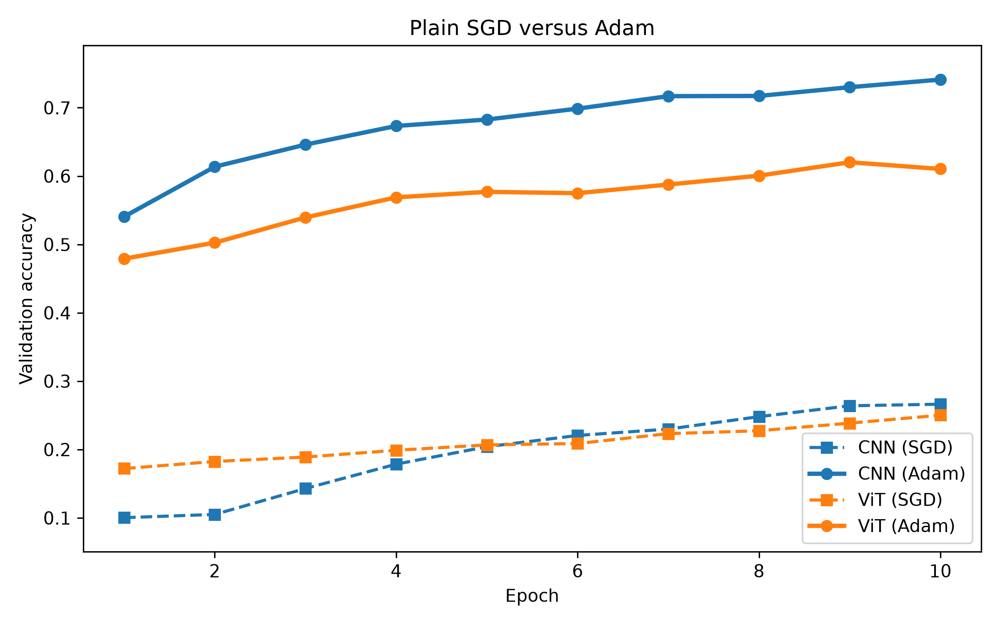

<!-- conv_sgd,conv,sgd,10,10,128,0.001,0.0,2,598,2.13058634,0.26630000,2.9928

conv_baseline,conv,adam,10,10,128,0.001,,2,598,0.82664020,0.73470000,3.0096

vit_sgd,vit,sgd,10,10,128,0.001,0.0,2,598,2.06730030,0.25020000,3.7300

vit_baseline,vit,adam,10,10,128,0.001,,2,598,1.08878851,0.61040000,3.7338

-->

### Question 5:  Compare all four classifiers. Which would you select and why?
Evaluating the architectures by validation accuracy, the linear, three-layer (MLP), ViT, and CNN models achieved validation accuracies of 37.18%, 47.78%, 66.15%, and 77.7%, respectively. As expected, the CNN and ViT significantly outperformed the linear architectures, as they are better suited for the spatial reasoning required by the high-dimensional nature of images rather than simply flattening them.
I would select the 5-layer CNN, as it not only achieved the highest accuracy but also had a shorter training time than the 5-layer ViT.
The 5-layer CNN took 31.56s while the 5-layer ViT took 49.23s
Given the short training time, the simple dataset, and the simplicity of implementation, the CNN is the best option.

### Question 6: For CNN and ViT, how did increasing the number of layers from 2 to 5 affect accuracy, convergence, and training time?
Increasing the network depth/layers increased validation accuracy for both CNN and ViT architectures. For the CNN, accuracy increased from 73.47% to 77.7%. We also notice that the training performance climbs slightly slower for the 5-layer CNN than the 2-layer CNN but eventually converges to a better performance. There is also an increase in total training time from  30.09s to 31.56s. Similarly, for the ViT, we notice the same trend; final accuracy increases from 61.04% to 66.15%. However, the training time increases significantly from 37.63s to  49.23s..
Increasing the number of layers/depth improves the accuracy and performance of our architecture, but this comes with a trade-off in training time, with the difference being much more significant for the ViT.

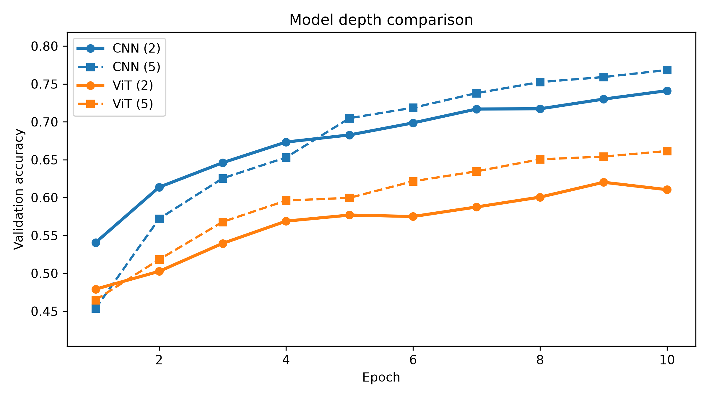
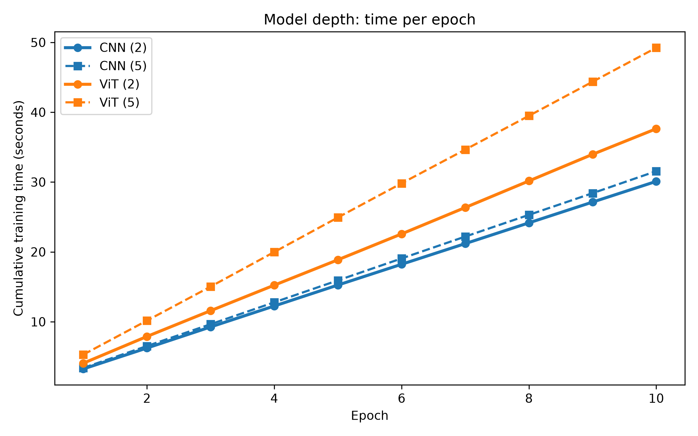

### Question 7: For CNN and ViT, compare plain SGD, SGD with momentum, Adam, and AdamW. What differences did you observe, and which optimizer would you select?
We examine the optimizers using the same architectures and parameters with 2-layer networks for this analysis.

1. Plain SGD: Has the worst performance overall (CNN: 26.6%, ViT: 24.5%).

2. SGD with momentum: Adding momentum significantly increases performance compared to plain SGD (CNN: 51.4%, ViT: 46.4%).

3. Adam: Significant improvement and faster convergence, reaching a performance of (CNN: 73.7%, ViT: 61.29%).

4. AdamW: This optimizer produced the best performance of all the optimizers (CNN: 74.11%, ViT: 61.23%); however, it is only a slight improvement over Adam. 

For CNN, AdamW took 30.07s, almost similar to Adam at 30.09s. For ViT, AdamW took 38.57s, slightly longer than Adam at 37.63s.
Optimizer Choice: I would select the AdamW optimizer, as it matched the convergence and performance of Adam with little to no trade-off in training time and includes decoupled weight decay and regularization capabilities. However, the difference in performance is minuscule in these experiments.
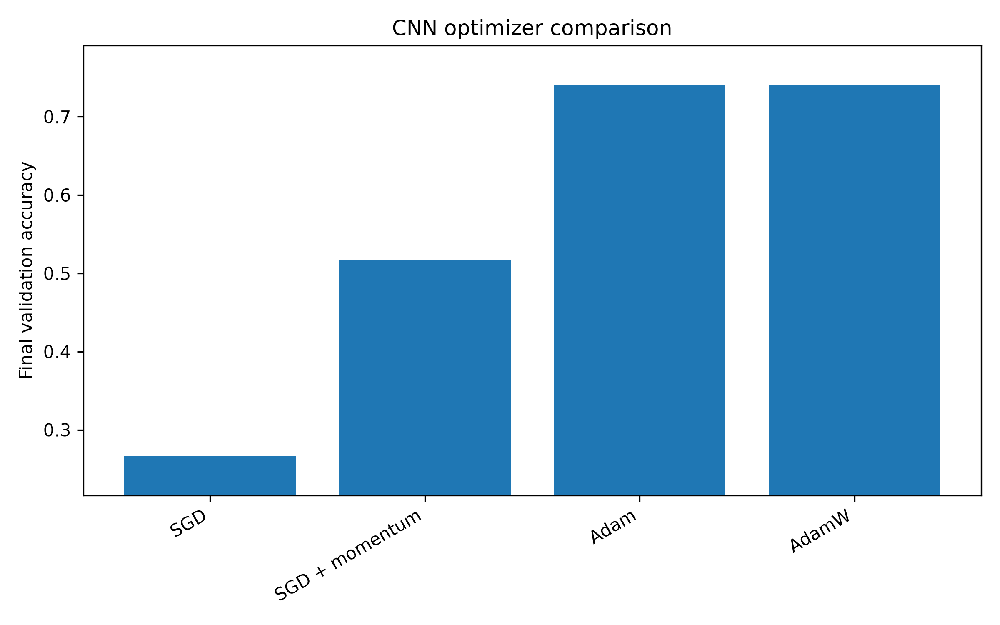
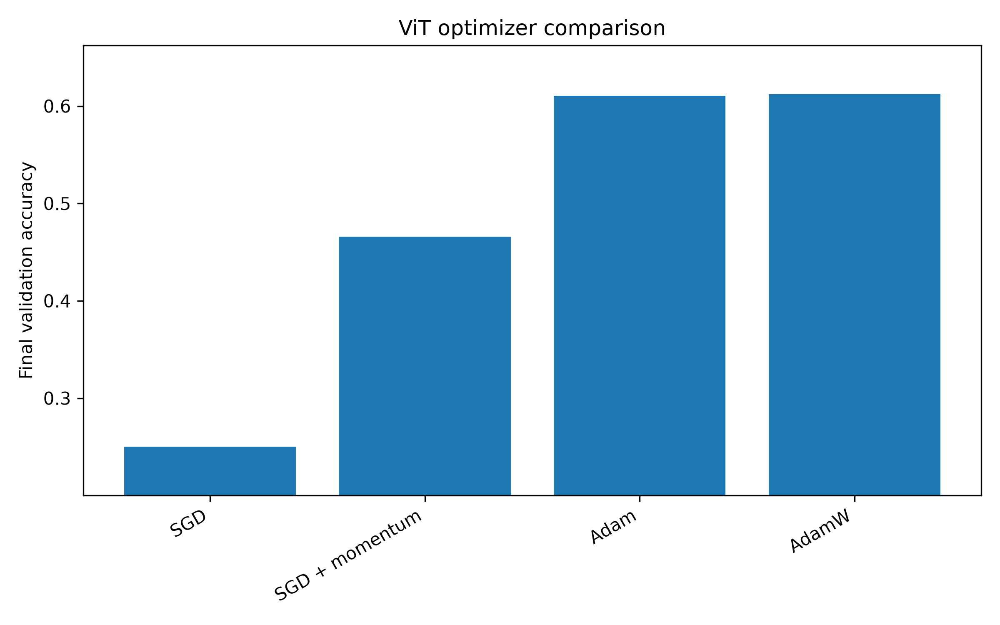

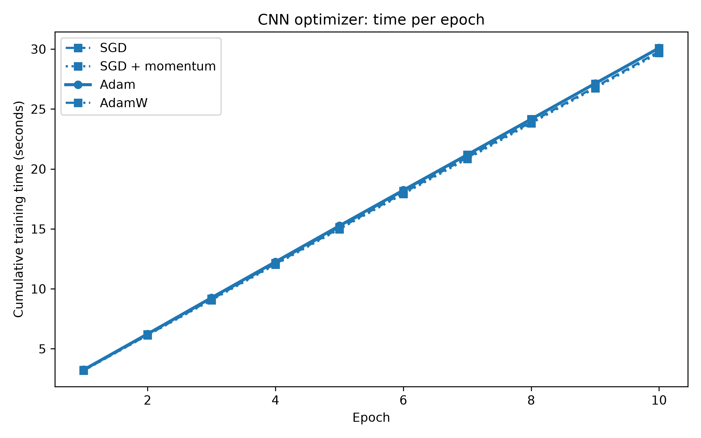
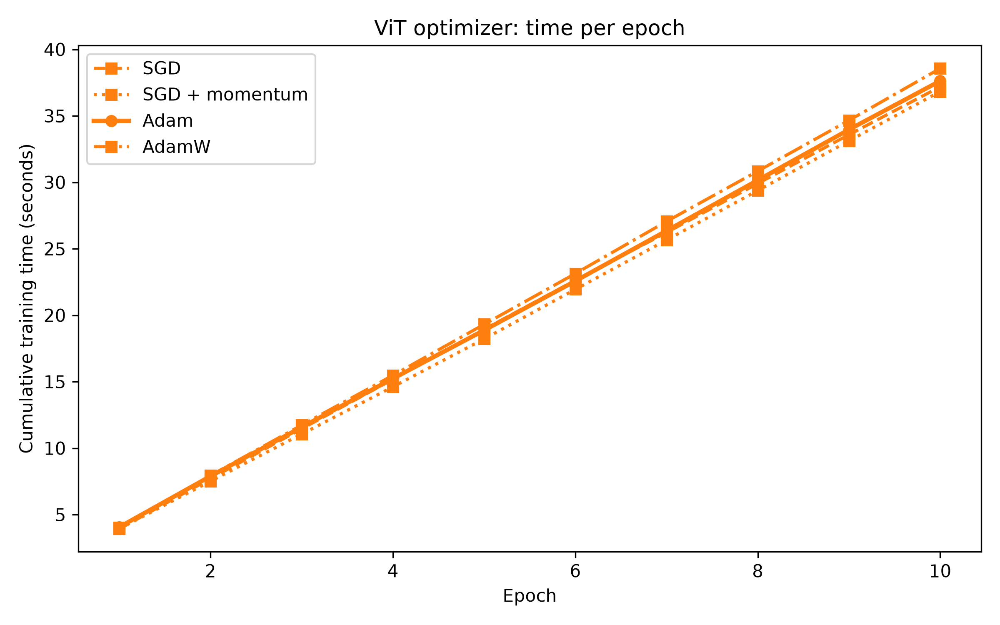